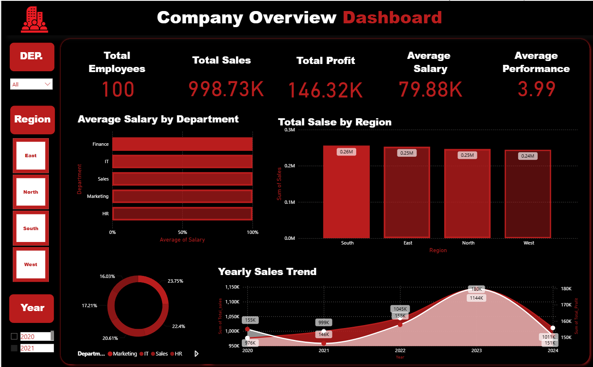
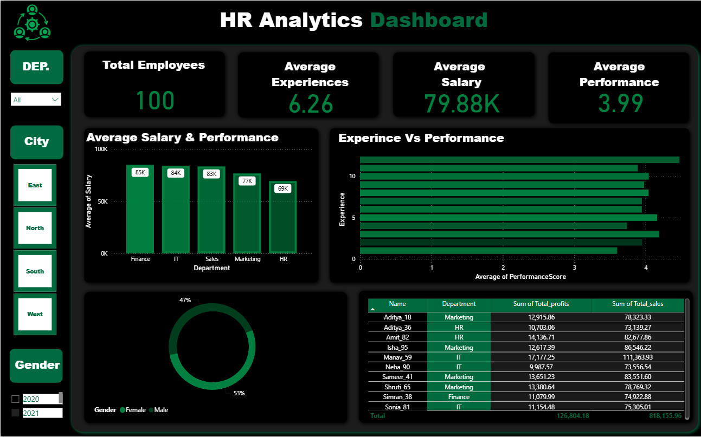
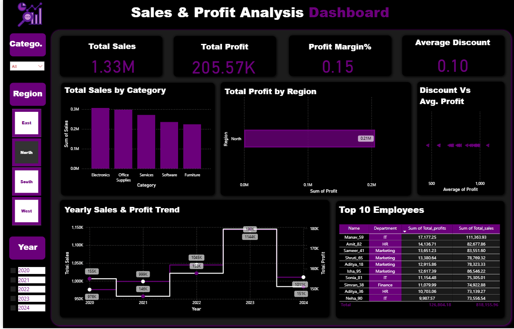
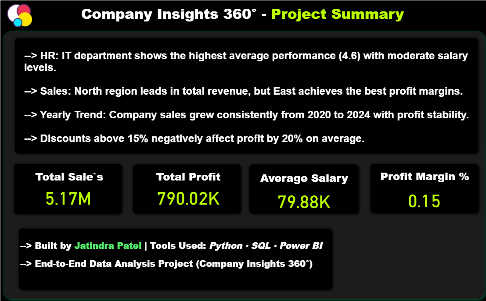

<div align="center">

# 🧠 Company Insights 360°
### An End-to-End HR, Sales & Performance Analytics Project

**Python · SQL · Power BI · Statistical Analysis · Forecasting**

[](https://www.python.org/)
[](https://pandas.pydata.org/)
[](https://www.sqlite.org/)
[](https://powerbi.microsoft.com/)
[](https://scikit-learn.org/)
[](https://colab.research.google.com/github/JatindraPatel/company-insights-360/blob/main/analysis_script.ipynb)
[](LICENSE)

**[GitHub](https://github.com/JatindraPatel) · [LinkedIn](https://linkedin.com/in/jatindrapatel/) · [Portfolio](https://jatindraportfolio.vercel.app/)**

</div>

---

## 📌 Overview

**Company Insights 360°** is a simulated organization's analytics stack, built to show the
full journey data takes from raw files to a boardroom-ready dashboard:

CSV extracts → Data validation & cleaning → SQLite warehouse → SQL analysis
→ Statistical checks & a sales forecast → Charts → Power BI dashboard


It covers three business domains in one connected model — **HR** (salary, performance,
tenure), **Sales** (revenue, profit, regions, discounts), and **Operations** (department
budgets vs. actual spend) — and answers each question with SQL first, Python second,
rather than hard-coding numbers.

## 🗂️ Project Structure

company-insights-360/
├── data/
│   ├── employees.csv          # 100 employees — dept, role, salary, tenure, performance
│   ├── sales.csv               # 1,000 orders — region, category, sales, profit, discount
│   └── departments.csv         # 5 departments — manager, budget, headcount
├── analysis_script.ipynb       # Full Python + SQL analysis pipeline (runs end-to-end)
├── Company_Insights_360.pbix   # Power BI dashboard (4 report pages)
├── exports/                    # Query results exported as CSV, ready for Power BI refresh
├── assets/                     # Auto-generated charts (correlation, trends, forecast)
├── requirements.txt
└── README.md

## 🧩 Tech Stack

| Layer | Tools |
|---|---|
| Language | Python 3.11 |
| Data wrangling | pandas, NumPy |
| Database | SQLite (window functions, CTEs) |
| Visualization | Matplotlib, Seaborn |
| Forecasting | scikit-learn (Linear Regression) |
| BI / Dashboard | Power BI, DAX |
| Notebook | Jupyter |

## 🔍 What's in the Analysis

The notebook (`analysis_script.ipynb`) walks through 10 SQL-driven business questions plus
a statistics layer, all in one reproducible run:

1. Average salary, performance & tenure by department
2. Total sales, profit and **margin** by region (margin ≠ revenue leader — see below)
3. Top 10 employees by sales, ranked with a `RANK()` window function
4. Department-wise share of total company profit
5. Monthly sales trend with a running (cumulative) profit total
6. Discount vs. profit relationship, with the correlation coefficient computed
7. Employee tenure bands vs. performance and salary
8. Top 10 customers by revenue and profit
9. Region × Category sales matrix (pivot)
10. Department budget utilization — actual salary cost vs. allocated budget

...plus a **correlation heatmap** across salary/performance/tenure/experience, **IQR-based
outlier detection** on order-level sales, and a **linear-trend sales forecast** for the
next year.

## 📊 Key Insights

| Metric | Value |
|---|---|
| Total Revenue | ₹51.7L |
| Total Profit | ₹7.9L |
| Company Profit Margin | 15.3% |
| Employees Analyzed | 100 |
| Avg. Performance Score | 3.99 / 5 |
| Highest-Revenue Region | South |
| Highest-Margin Region | West (15.9%) |
| Top Profit-Contributing Dept. | Marketing (23.8% of profit) |
| Next-Year Sales Projection | ₹10.99L (linear trend) |

**Notable findings:**
- Revenue leadership and margin leadership **don't belong to the same region** — South
  brings in the most revenue, but West converts it to profit most efficiently. Targets
  built only around top-line revenue would miss that.
- **Discount and profit move in opposite directions** — orders above a ~15% discount
  consistently show thinner margins, which is a good threshold for a discount-approval rule.
- Employees with **8+ years of tenure post the highest average performance score**
  (4.08 vs. 3.9 for newer hires) — useful evidence for retention-focused HR investment.
- **Marketing and IT are running well above their allocated salary budget** (207% and
  185% utilization respectively) while Sales, the largest team, is under-budget relative
  to headcount — a clear input for the next budget planning cycle.

## 📈 Dashboard Preview

The Power BI dashboard has 4 pages — a company-wide overview, an HR deep-dive, a
Sales & Profit analysis, and an executive summary.

**Company Overview**


**HR Analytics**


**Sales & Profit Analysis**


**Project Summary**


## ▶️ How to Run

**Option A — Run locally (Jupyter):**
```bash
# 1. Clone the repo
git clone https://github.com/JatindraPatel/company-insights-360.git
cd company-insights-360

# 2. Install dependencies
pip install -r requirements.txt

# 3. Run the notebook end-to-end
jupyter notebook analysis_script.ipynb
# (Run All — it rebuilds company_insights.db, all charts in assets/, and all exports/*.csv)
```

**Option B — Run instantly in your browser (no install needed):**

Click the badge below to open and run the notebook directly in Google Colab —
Colab pulls the notebook straight from this repo, so anyone can run it without
setting up Python locally.

[](https://colab.research.google.com/github/JatindraPatel/company-insights-360/blob/main/analysis_script.ipynb)

> Note: since Colab runs in the cloud, the notebook's first data-loading cell needs the
> `data/*.csv` files available. Either upload them via the Colab file browser, or add a
> cell at the top that clones this repo
> (`!git clone https://github.com/JatindraPatel/company-insights-360.git` then
> `%cd company-insights-360`) before running the rest of the notebook.

**Then, view the dashboard:**
Launch `Company_Insights_360.pbix` in Power BI Desktop, then **Refresh** to pull the
latest `exports/*.csv` if the data has changed.

## 🚀 Possible Next Steps

- Swap the linear sales projection for a seasonal model (Prophet / SARIMA) once more
  years of history are available.
- Add a `Row-Level Security` role in Power BI so each department manager only sees their
  own team's data.
- Move the SQLite warehouse to PostgreSQL and schedule the notebook with Airflow/cron
  for a recurring refresh.
- Add employee attrition prediction (classification model) using tenure, performance and
  salary as features.

## 👨‍💻 Author

**Jatindra Patel**
Data Analyst | Python · SQL · Power BI

[](https://github.com/JatindraPatel)
[](https://linkedin.com/in/jatindrapatel/)
[](https://jatindraportfolio.vercel.app/)

---
<div align="center">⭐ If this project helped you, consider giving it a star!</div>
